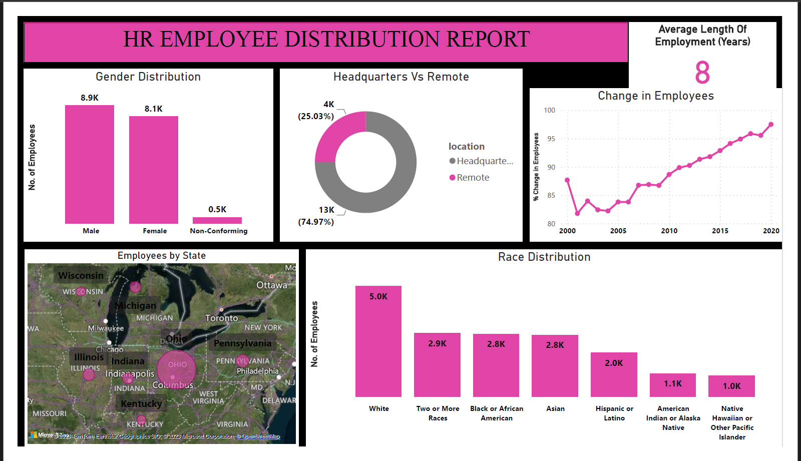

# HR-Employee-Dashboard-Using-MySQL-PowerBI
HR Employee Distribution dashboard is created by using MySQL and Power BI.

## Introduction
 In this project, I have curated and analyzed a dataset containing detailed information about HR employees, including hire date, birth date, termination date, and other workplace details.

## Use case
The dataset was initially in CSV format, and I've undertaken the process of loading and cleaning the data using MySQL. After thorough analysis and the creation of meaningful SQL queries, the results were exported to Power BI. The final output is a dynamic and insightful dashboard that visually represents key metrics related to the HR employees, offering valuable insights into their demographics, tenure, and other relevant factors.

### Source Data Set
The CSV file, serving as the input dataset, contains information about human resource employees and consists of 22,215 rows.

### SQL Scripts
We didn't use records where the age was negative (967 records), and we only looked at ages 18 and older. Also, we didn't include records with termination dates way in the future (1599 records). We only considered termination dates that are on or before the current date.

Questions taken for the analysis:

1. What is the gender breakdown of employees in the company?
2. What is the race/ethnicity breakdown of employees in the company?
3. What is the age distribution of employees in the company?
4. How many employees work at headquarters versus remote locations?
5. What is the average length of employment for employees who have been terminated?
6. How does the gender distribution vary across departments and job titles?
7. What is the distribution of job titles across the company?
8. Which department has the highest turnover rate?
9. What is the distribution of employees across locations by state?
10. How has the company's employee count changed over time based on hire and term dates?
11. What is the tenure distribution for each department?

### Dashboard Creation Using Power BI
The results of the queries are exported to separate CSV file, and the data is then loaded into Power BI to generate a straightforward dashboard illustrating various details about human resources employees.
